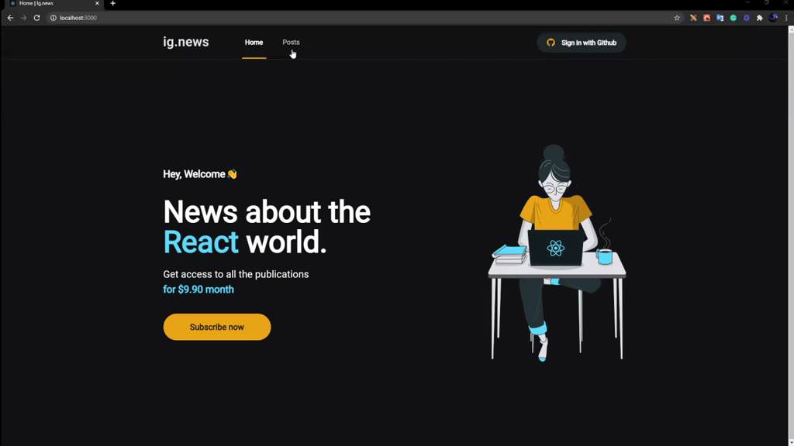

<h1 align='center'>Ig News</h1>

<h1 align="center">
  
</h1>

## About 🚀

This project was built to get knowledge about the principles of NextJs.

In this project, we use getServerSide and getStatic, and we can see what each one of them is util.

---

## Techs ✔
- [React JS](https://reactjs.org/)
- [Next JS ](https://nextjs.org/)
- [CSS Modules/SCSS](https://github.com/css-modules/css-modules)
- [Typescript](https://www.typescriptlang.org/)
- [Stripe API](https://stripe.com/en-br)

---

## How to install 💻

```bash
#First clone this project on your preference path

$ git clone https://github.com/Luan4560/Ig.News.git

# Then got to you path, open the project and install the dependecies.

$ yarn or npm install

# After that, just initilialize the project with:

$ yarn dev
```
---

This project was made by Luan Nascimento 🤘 and provides
for Bootcamp Ignite by [Rocketseat](https://rocketseat.com.br/) 🚀


